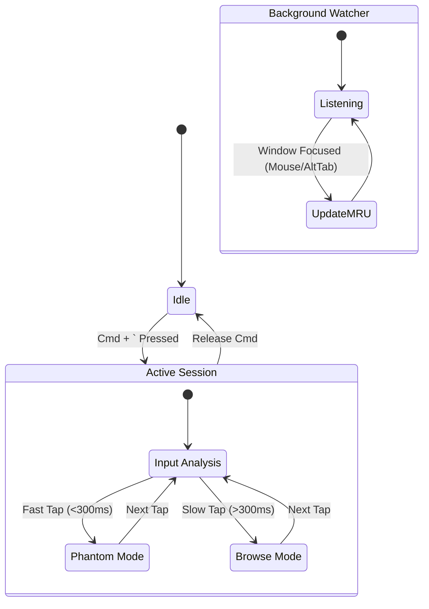

# Velocity-Vector Protocol

**The "Chaos Proof" macOS Window Switcher for Power Users**

> *For the 5% of power users who've been silently gaslit by `Alt+Tab`.*

---

## Table of Contents

1.  [The Problem](#the-problem)
2.  [The Solution](#the-solution)
3.  [The Creation Story](#the-creation-story)
4.  [Architecture](#architecture)
5.  [Key Concepts](#key-concepts)
6.  [Controls & Hotkeys](#controls--hotkeys)
7.  [User Stories](#user-stories)
8.  [Installation](#installation)
9.  [Troubleshooting](#troubleshooting)
10. [FAQ](#faq)
11. [License](#license)

---

## The Problem

If you are a **Windows refugee on macOS**, you know the pain.

| macOS "Feature" | The Reality |
| :--- | :--- |
| `Cmd+Tab` | Switches **apps**, not windows. Useless if you have 5 Chrome windows. |
| `Cmd+` ` | Cycles windows, but **loses context** when you switch Workspaces. |
| AltTab.app | Closest to salvation, but suffers from **MRU Corruption**. |

**The MRU Corruption Bug:**
You're on Workspace 1 (VSCode + Chrome). You bounce between them with `Cmd+` `. Perfect.
You switch to Workspace 2 (Slack). You reply.
You hit `Cmd+` ` to go back... and you land on a **random Terminal window** from 3 hours ago.

You blame your muscle memory. You slow down. You try again. It still fails.

**It's not you. It's the architecture.** Single-list MRU models corrupt silently during workspace transitions. We call this **Silent MRU Corruption (SMRC)**.

---

## The Solution

**Velocity-Vector** is a **Biomimetic State Machine** written in Lua for Hammerspoon. It reads your *intent* using two dimensions:

1.  **Velocity (Time):** How *fast* are you tapping?
2.  **Vector (Direction):** Are you pressing Arrow keys to change Workspace?

This allows it to distinguish between **Panic** ("I need to go BACK!") and **Browse** ("Let me find that other window...").

### Key Features

| Feature | Description |
| :--- | :--- |
| 🧠 **Velocity Navigation** | Fast Tap = Instant Bounce. Slow Tap = Browse with UI. |
| 👀 **Omniscient Tracker** | Tracks *all* window focus changes, even from **Mouse clicks** or native `Cmd+Tab`. |
| 🌌 **Ghost Mode** | Zero startup lag. First switch is instant; cache warms in background. |
| ⚓ **Memory Anchors** | Pin a window. Jump to it. Jump back. 3-window workflow. |
| 🎯 **Workspace Vectors** | Hold `Cmd`, press Arrow keys to slide between Spaces. |
| 🧹 **Janitor Protocol** | Prevents "Stuck UI" by force-cleaning the overlay on key release. |

---

## The Creation Story

> *A Refugee's Manifesto*

### Act I: The Exile (November 2024)

I am a refugee. Not from a country, but from an operating system.

After 15 years of Windows muscle memory—where `Alt+Tab` meant **every window was a first-class citizen**—I was forced onto macOS by the M-series chip's ludicrous efficiency. Within 48 hours, I knew something was broken.

### Act II: The Gaslighting

I installed **AltTab.app**. It almost worked. *Almost*.

My workflow: 50 windows across 3 Workspaces. I would bounce between VSCode and Chrome, switch to Slack, reply, then `Alt+Tab` back... and land on a **random Terminal**.

*"I must be releasing `Cmd` too slow,"* I told myself. *"My timing is off."*

For three days, I blamed my muscle memory. Then I logged AltTab's internal MRU list. The list **corrupted on every workspace switch**. The global pointer was being overwritten by workspace-local state.

This wasn't user error. It was **architectural failure**. I found 12 complaints in the GitHub issues, all closed as "user configuration error." The maintainers didn't use Workspaces. They couldn't reproduce the bug.

### Act III: The Velocity Insight

While building my fix in Hammerspoon, I noticed something: my thumb tempo **revealed my intent**.

-   **Fast taps** meant: *"Panic! Go back!"*
-   **Slow taps** meant: *"I'm looking for something."*

I added a 300ms velocity threshold. The interaction became **magical**—like the system could read my mind.

### Act IV: The Platinum Standard (v25.9.3)

We added:
-   **Ghost Mode** for zero-latency first use.
-   **Memory Anchors** because I needed Slack accessible without breaking my A↔B flow.
-   **Workspace Vectors** because `Cmd+Ctrl+` ` was too awkward. Arrow keys are muscle memory.
-   **Space Watcher**, **Coroutine Cache**, **Reverse Browse**, **Escape Cancel**, **App Icon Overlay**.

The result is the **Velocity-Vector Protocol v25.9.3 Platinum (Enhanced)**.

---

## Architecture



### Key Architectural Decisions

| Decision | Rationale |
| :--- | :--- |
| **Custom `hs.canvas` UI** | The native `hs.window.switcher` is too rigid for Velocity logic. It forces linear cycling. |
| **Global `shadowWatcher`** | Tracks windows across *all* Spaces. Required for the "Omniscient Tracker" feature. |
| **O(1) Session Filtering** | At activation, filters the global list by `currentSpace`. Prevents the 40s Chrome lag. |
| **Janitor Protocol** | A parallel `eventtap` watches for `Cmd` key release. Forces UI cleanup even if the main loop hangs. |

---

## Key Concepts

### The "Bounce" (Panic Mode)
-   **Trigger:** A single, fast tap of `Cmd + ` ` (<300ms).
-   **Behavior:** Instantly focuses the **previous window** (Index 2). No UI.
-   **Philosophy:** *"If I'm moving fast, I know where I'm going."*

### The "Browse" (Search Mode)
-   **Trigger:** Holding `Cmd` and tapping ` ` ` slowly (>300ms).
-   **Behavior:** Shows a high-res preview. Each tap advances the selection.
-   **Philosophy:** *"I'm looking for something. Show me what I'm selecting."*

### The "Phantom Scroll" (Machine Gun Mode)
-   **Trigger:** Holding `Cmd` and tapping ` ` ` *very fast*.
-   **Behavior:** Index advances (2 -> 3 -> 4...), but the **UI is hidden**.
-   **Philosophy:** *"I know it's 5 taps away. I don't need to see the first 4."*

### The "Omniscient Tracker" (External Interaction Guarantee)
-   **Scenario:** You use the **mouse** to click a Chrome window.
-   **Result:** The background watcher sees this. Chrome becomes Index 1. Your previous window is Index 2.
-   **Next Action:** If you tap `Cmd + ` `, you will bounce **back** to your previous window, not forward.
-   **This is guaranteed.** It works for mouse clicks, native `Cmd+Tab`, and even Dock clicks.

---

## Controls & Hotkeys

| Hotkey | Action | Description |
| :--- | :--- | :--- |
| `Cmd + ` ` (Tap) | **Bounce** | Toggles between current and previous window. |
| `Cmd + ` ` (Hold) | **Browse** | Shows UI. Each tap advances selection. |
| `Cmd + Shift + ` ` | **Reverse** | Cycles **backwards** through the list. |
| `Escape` | **Cancel** | Closes UI, reverts to original window. |
| `Cmd + Arrow (L/R)` | **Vector** | Switches the active macOS Workspace. |
| `Cmd + Opt + ` ` | **Anchor** | Sets or Jumps to a "Memory Anchor" window. |
| `Cmd + Ctrl + ` ` | **Cycle Space** | (Fallback) Moves to the next Workspace. |

### Configuration (Edit `init.lua`)

| Variable | Default | Description |
| :--- | :--- | :--- |
| `CONFIG.velocityThreshold` | `0.30` | Seconds. Taps faster than this = Bounce. |
| `CONFIG.preCacheCount` | `5` | Thumbnails to pre-cache after each session. |
| `CONFIG.cacheBatchSize` | `10` | Windows per batch in async cache rebuild. |

---

## User Stories

### Story 1: The Coder's Toggle
**User:** Jane, a Full Stack Dev.
**Context:** Editing `server.js` in VSCode. Reading docs in Chrome.
**Action:** Jane taps `Cmd + ` ` quickly.
**Result:** Focus snaps to Chrome. She reads. She taps `Cmd + ` ` again. Focus snaps back to VSCode.
**Why:** Zero latency. No UI flash. Pure muscle memory.

### Story 2: The Designer's Search
**User:** Mark, a UI Designer.
**Context:** Has 5 Figma windows, 3 Photoshop windows, and Spotify.
**Action:** Mark holds `Cmd` and taps ` ` ` slowly.
**Result:** He sees previews of each window. He cycles until he finds "Project X - Final". He releases `Cmd`.
**Why:** Visual confirmation ensures he picks the right canvas.

### Story 3: The Space Traveler
**User:** Sarah, a PM.
**Context:** Slack is on Space 1. Jira is on Space 2.
**Action:** Sarah holds `Cmd` and presses `Right Arrow`.
**Result:** The screen slides to Space 2. She keeps holding `Cmd` and taps ` ` `.
**Result:** The switcher now shows only the windows on Space 2 (Jira).
**Why:** Context-aware switching keeps her focused.

### Story 4: The Mouse Hybrid
**User:** Alex, a Gamer.
**Context:** Playing a game in Windowed mode. Clicks Discord on a second monitor.
**Action:** Alex clicks Discord with the mouse. Then taps `Cmd + ` `.
**Result:** Focus snaps **back** to the Game.
**Why:** The `shadowWatcher` saw the mouse click and updated the stack. The tool knows Discord was the *new* focus, so a "Bounce" goes back.

---

## Installation

### Prerequisites
-   **macOS Monterey or later** (Tested on Sonoma, Sequoia)
-   **Hammerspoon** (Free, Open Source)

### Steps

1.  **Install Hammerspoon:**
    ```bash
    brew install --cask hammerspoon
    ```

2.  **Download the Script:**
    Save `init.lua` from this repository to `~/.hammerspoon/init.lua`.

3.  **Grant Permissions:**
    Go to **System Settings → Privacy & Security**.
    Grant Hammerspoon:
    -   **Accessibility** (Required to focus windows)
    -   **Screen Recording** (Required for window snapshots/previews)

    > [!WARNING]
    > If you skip Screen Recording, you will see a "Big X" icon instead of thumbnails.

4.  **Reload Config:**
    Click the Hammerspoon icon in the menu bar → **Reload Config**.
    You should see an alert: `v25.9.3 Platinum (Enhanced)`.

---

## Troubleshooting

| Symptom | Cause | Fix |
| :--- | :--- | :--- |
| **"Big X" icon** | Missing Screen Recording permission. | System Settings → Privacy → Screen Recording → Toggle Hammerspoon. |
| **No response to `Cmd+` `** | Hammerspoon not running or config error. | Open Hammerspoon Console (`Cmd+Opt+C`), check for Lua errors. |
| **"Sticky" feel on first press** | Ghost Mode is active (expected). | Wait ~1s for cache to warm. This is by design. |
| **Chrome tabs not switching** | Limitation of macOS. Tabs are not "windows". | Open each tab in its own window (`Cmd+Shift+O`). |
| **UI overlay gets stuck** | Rare race condition. | Hit `Esc` or wait 5s for the Janitor to auto-clean. |

---

## FAQ

**Q: Why not just use AltTab.app?**
A: AltTab suffers from **MRU Corruption** when you switch Workspaces. Your "previous" window becomes unpredictable. Velocity-Vector tracks focus globally, guaranteeing consistency.

**Q: Does this work with multiple monitors?**
A: Yes. The global watcher tracks all windows on all screens. The Arrow keys switch Workspaces, which are screen-agnostic.

**Q: What is "Ghost Mode"?**
A: On the *very first* switch after a reload, the script uses a fast, raw OS query instead of waiting for the "heavy cache" to build. This makes the first interaction instant. The cache then builds in the background.

**Q: Can I change the velocity threshold (300ms)?**
A: Yes! Edit `CONFIG.velocityThreshold` at the top of `init.lua`.

---

## License

**MIT License.**

Hack it. Fork it. Fix your workflow.

---

*Velocity-Vector Protocol v25.9.3 Platinum (Enhanced) – The Omniscient Gearshift.*