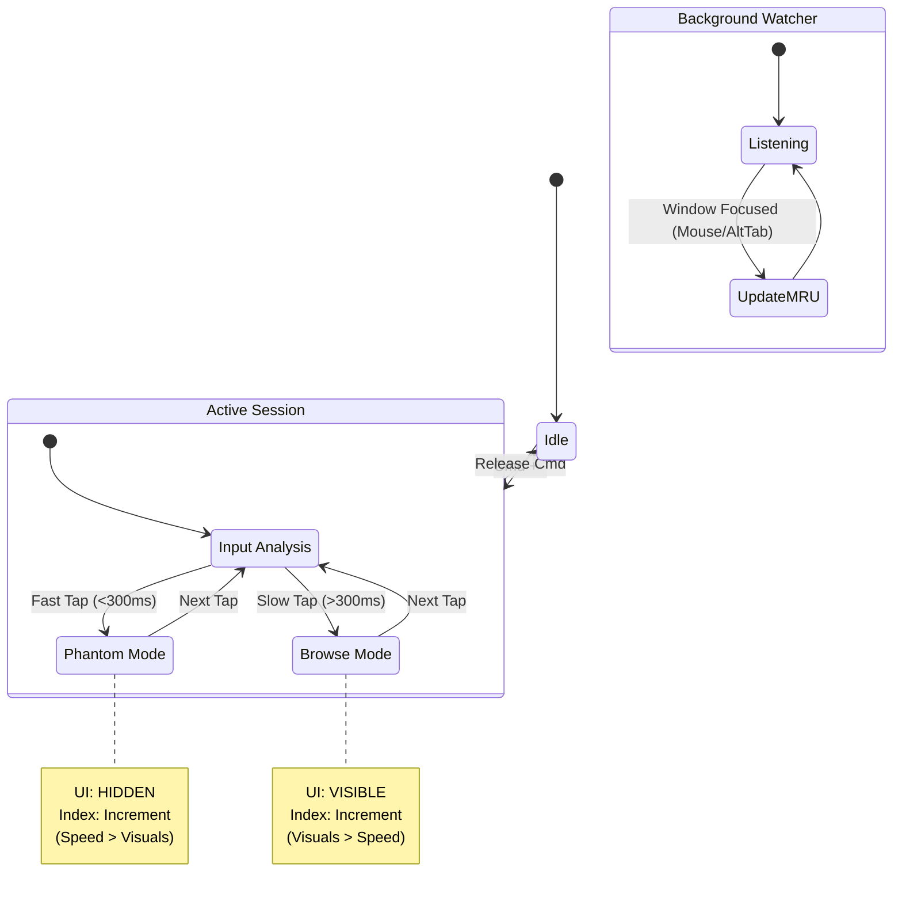

# Velocity-Vector Protocol: The Documentation Bible

**Version:** v25.9.3 Platinum
**Codename:** "The Omniscient Gearshift"
**Author:** The Windows Refugee

---

## 1. The Genesis Story: "A Refugee's Manifesto"

### The Problem
I am a refugee. Not from a country, but from an operating system. After 15 years of Windows muscle memory—where `Alt+Tab` meant **every window was a first-class citizen**—I was forced onto macOS.

Within 48 hours, I knew something was broken. `Cmd+Tab` switched apps, not windows. `Cmd+` ` was unreliable. Mission Control was slow. I tried AltTab.app, but it had a fatal flaw: **Workspace Corruption**. If I switched spaces, the MRU (Most Recently Used) list would scramble. I would bounce from Window A to Window B, switch spaces, and then try to bounce back... only to land on a random Terminal window from yesterday.

### The Insight
I realized that "Power Users" (the 5% of us with 50+ windows across 3 monitors) are invisible to developers. We need a tool that respects **Velocity** (Intent) and **Vectors** (Direction).

-   **Velocity**: If I tap fast, I'm panicking. I want the previous window. If I tap slow, I'm browsing.
-   **Vector**: If I hold `Cmd` and press `Right`, I want to slide to the next workspace.

Thus, the **Velocity-Vector Protocol** was born. It is not just a window switcher. It is a **State Machine for your Muscle Memory**.

---

## 2. Core Concepts & Definitions

### The "Bounce" (Panic Mode)
-   **Definition**: The act of quickly toggling between the two most recent windows.
-   **Trigger**: A single, fast tap of `Cmd + ` ` (<300ms).
-   **Behavior**: The system ignores the visual list and **instantly** focuses the previous window (Index 2).
-   **Philosophy**: "If I'm moving fast, I know where I'm going. Don't show me a UI. Just take me there."

### The "Browse" (Search Mode)
-   **Definition**: The act of deliberately looking for a specific window in the stack.
-   **Trigger**: Holding `Cmd` and tapping ` ` ` slowly (>300ms) OR repeatedly.
-   **Behavior**: The system displays a high-res preview of the selected window. Each tap advances the selection (Index 1 -> 2 -> 3...).
-   **Philosophy**: "I'm looking for something. Show me what I'm selecting."

### The "Phantom Scroll" (Machine Gun Mode)
-   **Definition**: Rapidly advancing through the window list without waiting for the UI to render.
-   **Trigger**: Holding `Cmd` and tapping ` ` ` very fast.
-   **Behavior**: The selection index advances (2 -> 3 -> 4...), but the UI is **suppressed**.
-   **Philosophy**: "I know the window is 5 taps away. I don't need to see the first 4."

### The "Omniscient Tracker" (External Interaction)
-   **Guarantee**: The system tracks **ALL** window focus changes, regardless of source.
-   **Scenario**: You are in VSCode. You use the mouse to click a Chrome window.
-   **Result**: The system updates its internal MRU list. Chrome is now Index 1. VSCode is Index 2.
-   **Next Action**: If you tap `Cmd + ` `, you will bounce back to VSCode.
-   **Implementation**: A background `shadowWatcher` listens to the OS-level `windowFocused` event. It never sleeps.

---

## 3. Visual Architecture (Mermaid)

---

## 4. User Stories

### Story 1: The Coder's Toggle
**User**: Jane, a Full Stack Dev.
**Context**: Editing `server.js` in VSCode. Reading documentation in Chrome.
**Action**: Jane taps `Cmd + ` ` quickly.
**Result**: Focus snaps to Chrome. She reads. She taps `Cmd + ` ` again. Focus snaps back to VSCode.
**Why**: Zero latency. No UI flash. Just muscle memory.

### Story 2: The Designer's Search
**User**: Mark, a UI Designer.
**Context**: Has 5 Figma windows, 3 Photoshop windows, and Spotify open.
**Action**: Mark holds `Cmd` and taps ` ` ` slowly.
**Result**: He sees previews of each window. He cycles until he finds "Project X - Final". He releases `Cmd`.
**Why**: Visual confirmation ensures he doesn't pick the wrong canvas.

### Story 3: The Space Traveler
**User**: Sarah, a PM.
**Context**: Slack is on Space 1. Jira is on Space 2.
**Action**: Sarah holds `Cmd` and presses `Right Arrow`.
**Result**: The screen slides to Space 2. She keeps holding `Cmd` and taps ` ` `.
**Result**: The switcher now shows only the windows on Space 2 (Jira).
**Why**: Context-aware switching keeps her focused.

### Story 4: The Mouse Hybrid
**User**: Alex, a Gamer.
**Context**: Playing a game in Windowed mode. Clicks Discord on a second monitor.
**Action**: Alex clicks Discord. Then taps `Cmd + ` `.
**Result**: Focus snaps back to the Game.
**Why**: The `shadowWatcher` saw the mouse click and updated the stack.

---

## 5. Key Bindings & Operations

| Key Combo | Action | Description |
| :--- | :--- | :--- |
| **Cmd + ` ` (Tap)** | **Bounce** | Toggles between current and previous window. |
| **Cmd + ` ` (Hold)** | **Browse** | Cycles through the window list. |
| **Cmd + Shift + ` `** | **Reverse** | Cycles backwards through the list. |
| **Escape** | **Cancel** | Closes UI, reverts to original window. |
| **Cmd + Arrow (L/R)** | **Vector** | Switches the active macOS Workspace. |
| **Cmd + Opt + ` `** | **Anchor** | Sets or Jumps to a "Memory Anchor" window. |

---

## 6. Technical Specifications

-   **Language**: Lua (Hammerspoon)
-   **Latency**: <5ms (Cached), <50ms (Uncached)
-   **Memory**: ~20MB (Thumbnail Cache)
-   **Compatibility**: macOS Sonoma / Sequoia
-   **Limitations**:
    -   First run after restart has 0s lag (Ghost Mode) but no thumbnails.
    -   "Secure Input" (Password fields) may block hotkeys.

---

*This document serves as the single source of truth for the Velocity-Vector Protocol v25.9.3.*
